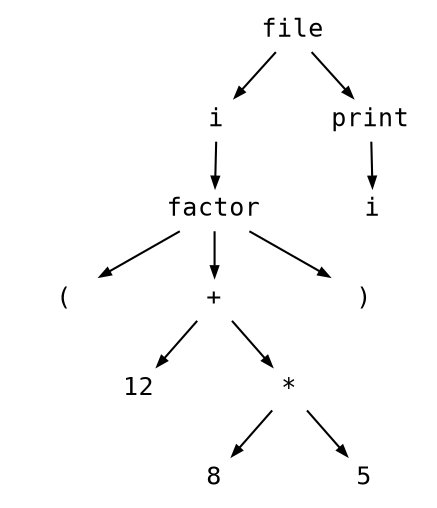

The Hyperscale Programming Language [](https://travis-ci.org/hyperscale/hyperscale)
===================================


This is the main source code repository for Hyperscale. It contains the compiler, standard library, and documentation.

This project is EXPERIMENTAL. The behaviour of this project, its name, and surrounding documentation may change without notice in a future release.

Building from Source
--------------------

### Building on *nix

1. Make sure you have installed the dependencies:

   * `g++` 4.7 or later or `clang++` 5.x or later
   * GNU `make` 3.81 or later
   * `cmake` 3.8.2 or later
   * `boost` 1.66.0 or later
   * `llvm` 5.0.1 or later
   * `curl`
   * `git`
   * `lcov`

2. Clone the [source] with `git`:

   ```sh
   $ git clone https://github.com/hyperscale/hyperscale.git
   $ cd hyperscale
   ```

[source]: https://github.com/hyperscale/hyperscale

3. Build and install:

    ```sh
    $ mkdir build
    $ cd build/
    $ cmake ../
    $ make
    ```

Example
-------

### Debug Pretty Print (format text)

simple.hyper
```
var i = (12 + 8 * 5);

print(i);

```

```sh
$ ./build/bin/hyperscale debug pretty-print ./dev/simple.hyper
```

```
>  SourceFile
>  >  VarDecl <line:1, col:1> used i
>  >  >  ParenExpr <line:1, col:9>
>  >  >  >  BinaryOperator <line:1, col:13> '+'
>  >  >  >  >  IntegerLiteral <line:1, col:10> 'int' 12
>  >  >  >  >  BinaryOperator <line:1, col:17> '*'
>  >  >  >  >  >  IntegerLiteral <line:1, col:15> 'int' 8
>  >  >  >  >  >  IntegerLiteral <line:1, col:19> 'int' 5
>  >  CallExpr <line:3, col:1> 'print'
>  >  >  DeclRefExpr <line:3, col:7> 'i'
```

### Debug pretty Print (format dot)

simple.hyper
```
var i = (12 + 8 * 5);

print(i);

```

```sh
$ ./build/bin/hyperscale debug pretty-print --format dot ./dev/simple.hyper
```




Features and roadmap
--------------------

- [ ] Command Line
    - [ ] Debug : Command for debugging compiler during development 
        - [x] Lexer
        - [ ] Parser
    - [ ] Build : Command for build project written in hyperscale
    - [ ] Test : Command for test project written in hyperscale
    - [ ] Bench : Command for benchmark project written in hyperscale
    - [ ] Lint : Command for linting project written in hyperscale
    - [ ] Package : Command for manage package in project written in hyperscale
- [ ] Compiler 
    - [x] Lexer
    - [ ] Parser
    - [ ] AST
    - [ ] Code Generator (LLVM)
- [ ] Standard Library
    - [ ] Spec
- [ ] Documentation
    - [ ] Grammar/Lexical Structure
    - [ ] Command Line
    - [ ] Standard Library


License
-------

See the [LICENSE](LICENSE.md) file for license rights and limitations (MIT).
